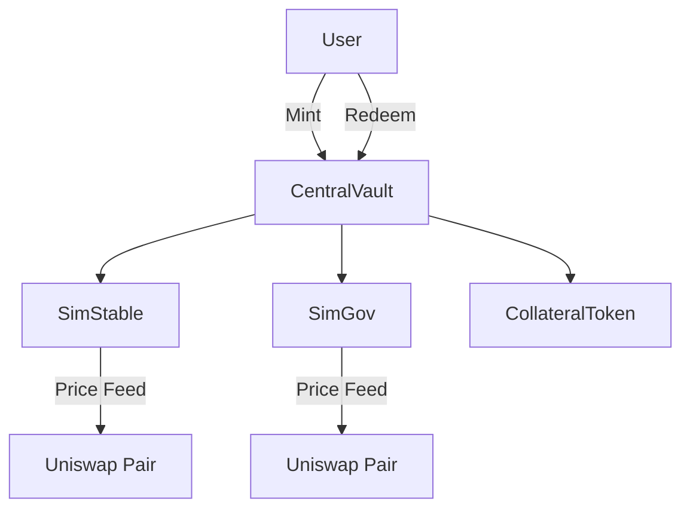
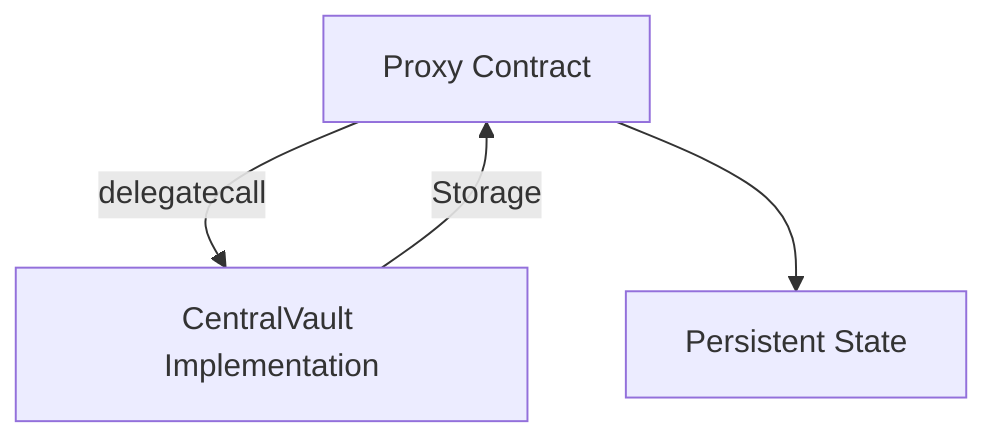

# DeFi Stablecoin Protocol with Algorithmic Stabilization

[](https://soliditylang.org)
[](https://opensource.org/licenses/MIT)

A decentralized finance protocol featuring a collateral-backed stablecoin with algorithmic stabilization mechanisms, governance token integration, and automated monetary policy adjustments.

## Key Features

- **Collateralized Stablecoin (SimStable)**
- **Governance Token (SimGov) Ecosystem**
- **Dynamic Collateral Ratio Adjustments**
- **Automated Buyback/Rebuy Mechanisms**
- **Price-Stabilization Algorithms**
- **Uniswap V2 Integration for Price Oracles**
- **Reentrancy-Protected Operations**
- **Comprehensive Test Coverage**

## Contracts Overview

### Core Contracts
| Contract | Description |
|----------|-------------|
| `CentralVault` | Main controller managing minting/redeeming, collateral ratios, and stabilization mechanisms |
| `SimStable` | ERC20 Stablecoin with transfer-triggered stabilization |
| `SimGov` | Governance token with vault-controlled mint/burn |

### Support Contracts
| Contract | Purpose |
|----------|---------|
| `MockERC20` | Test collateral token implementation |
| `MockUniswapV2Pair` | Uniswap V2 pair simulation for testing |
| `IUniswapV2Pair` | Interface for Uniswap V2 interactions |

## Key Mechanisms

1. **Minting System**
   - Collateral + SimGov burning → SimStable minting
   - Dynamic collateral ratio enforcement
   - Real-time price feed integration

2. **Redemption Engine**
   - SimStable burning → Collateral + SimGov minting
   - Proportional collateral distribution
   - Price-aware calculations

3. **Stabilization Features**
   - Automatic CR adjustments based on price deviation
   - Buyback mechanism for excess collateral
   - Re-collateralization protocol for system health

## Getting Started

### Prerequisites
- Node.js v16+
- Hardhat
- Git

### Installation
```bash
git clone https://github.com/<your-repo>.git
cd defi-stablecoin-system
npm install
````

### Test Suite
```bash
npx hardhat test
```

### Deployment
```bash
npx hardhat run scripts/deploy.js --network <network>
```

## Architecture Diagram



### Proxy Architecture


## Future Improvements

### Protocol Enhancements
- **DAO Governance**: Add voting for parameter adjustments
- **Advanced Oracles**: Chainlink integration for price feeds
- **Cross-Chain**: Bridge support for multi-chain operations
- **Liquidity Mining**: Incentivize protocol participation

### Security Improvements
- **Timelock Controller**: For sensitive operations
- **Multi-Sig Wallets**: For privileged actions
- **Formal Verification**: Certora/Scribble integration
- **Bug Bounty Program**: Crowdsourced security testing

### Feature Roadmap
- **Debt Market**: Create secondary markets for positions
- **Stability Pool**: Liquidations backstop fund
- **Insurance Fund**: Protocol-owned liquidity reserve
- **Advanced CR Models**: Machine learning integration

## Security Audit Status
⚠️ **Warning**: This code is unaudited and for educational purposes only. Use at your own risk.

## License
MIT License - see [LICENSE](LICENSE) for details
